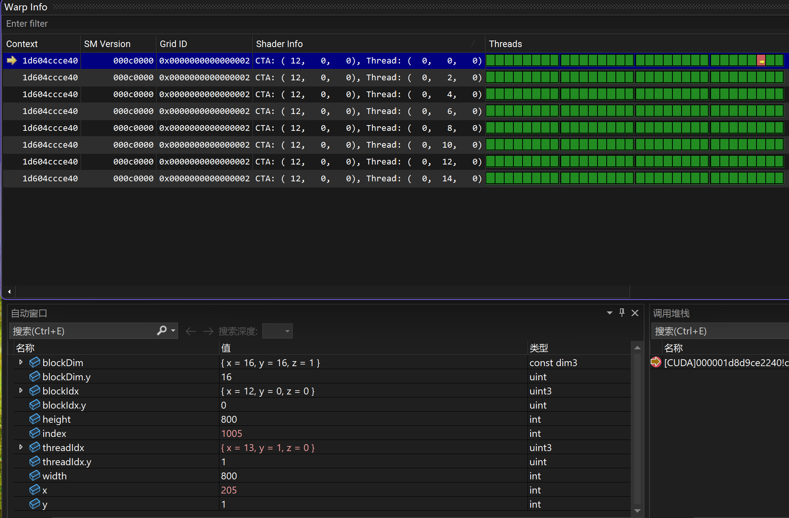
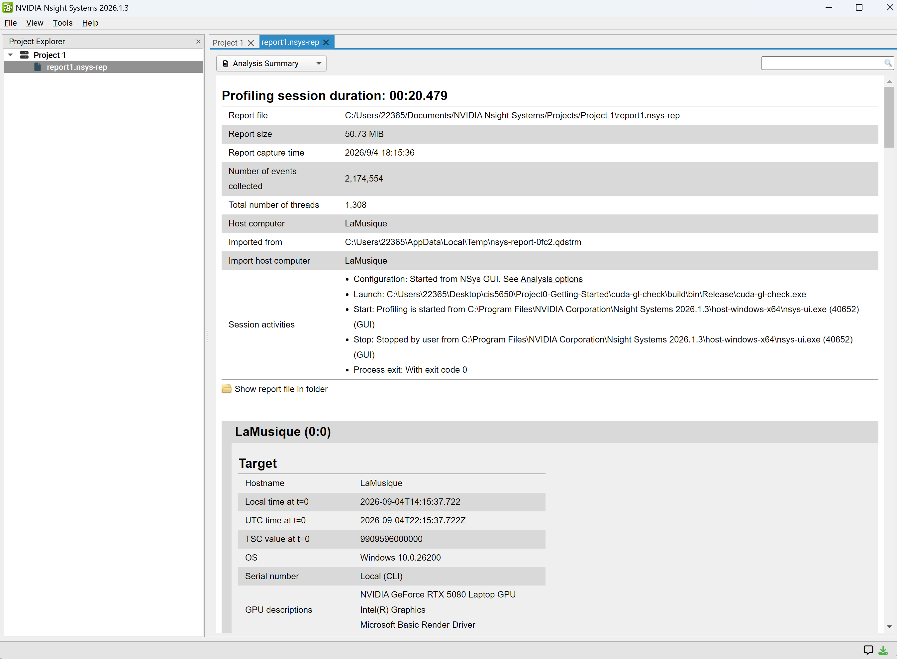
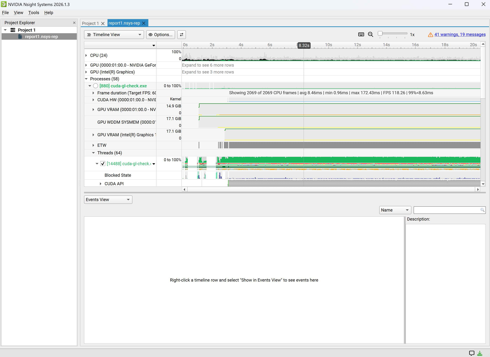
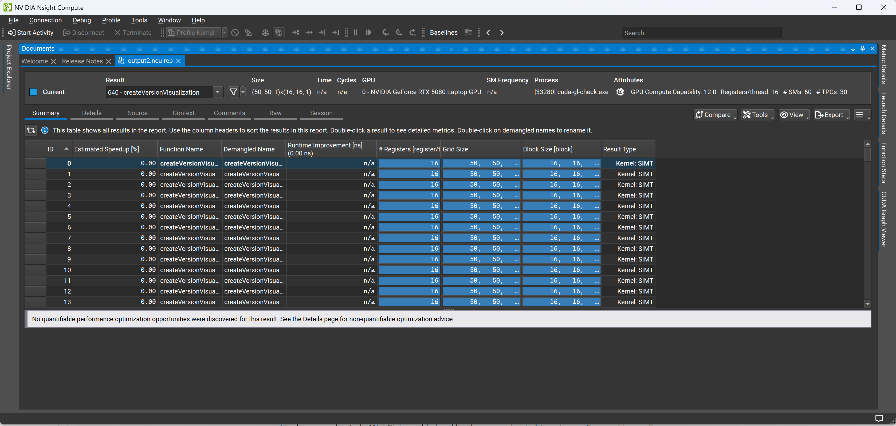
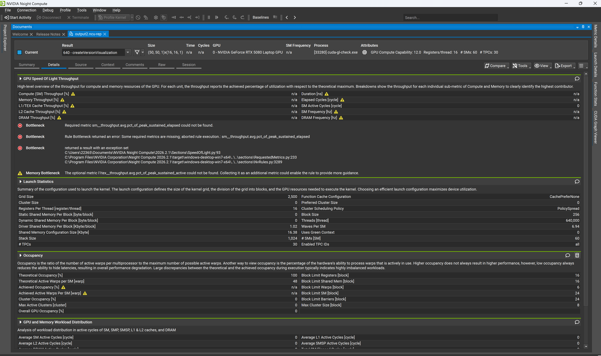
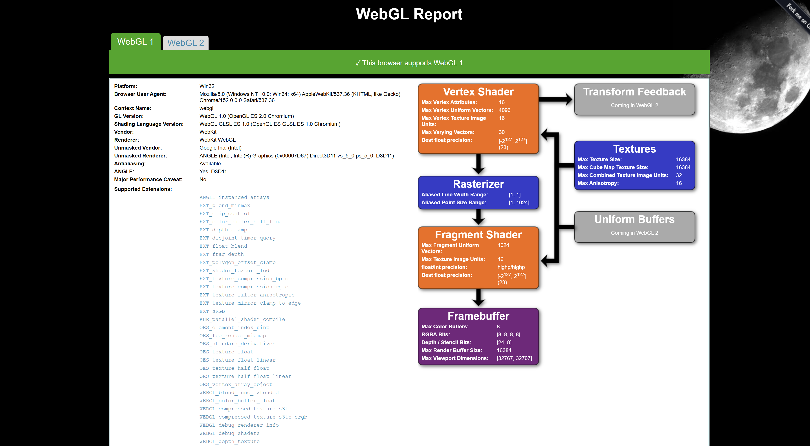
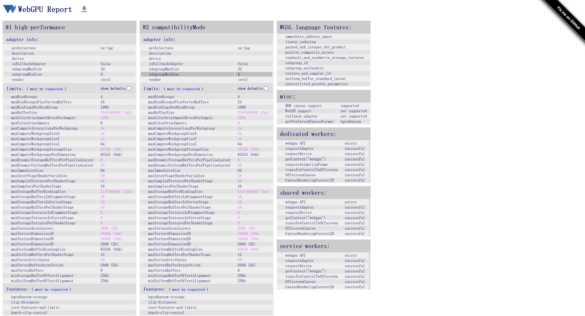

Project 0 Getting Started
====================

**University of Pennsylvania, CIS 5650: GPU Programming and Architecture, Project 0**
* Ziqiu Wang
* Tested on: 
Windows 11 Home, Intel Core Ultra 9 290HX Plus @ 2.7GHz 32GB, RTX 5080 16GB (Personal Computer)

### Results and Screenshots

Compute Capability: 12.0

